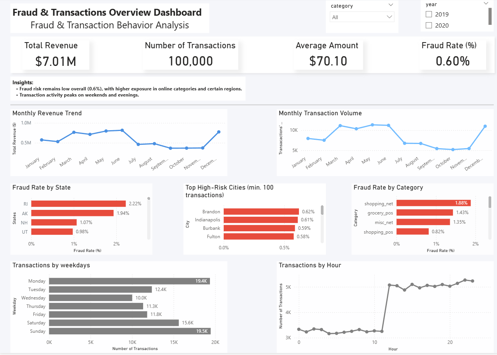

# Card Transactions Analysis & Fraud Detection

## 📊 Project Overview
This project explores credit card transactions to analyze customer behavior and identify fraud patterns.  
The analysis was performed using Python (EDA) and visualized in Power BI.

---

## 🧰 Tools & Technologies
- Python (Pandas, Matplotlib, Seaborn)
- Power BI
- Git & GitHub

---
## 📁 Project Structure

card-transactions-analytics/
│
├── assets/
│ └── dashboard.png
│
├── data/
│ ├── raw/ # original dataset (not uploaded)
│ ├── clean/ # cleaned dataset (not uploaded)
│ └── sample/
│ └── transactions_sample.csv
│
├── notebooks/
│ └── eda_card_transactions.ipynb
│
├── powerbi/
│ └── fraud_dashboard.pbix
│
├── .gitignore
└── README.md

---

## 🔍 Data Preparation
- Cleaned raw transaction dataset
- Removed unnecessary columns
- Created time-based features (month, weekday, hour)
- Handled missing values:
  - `merch_zipcode` contains many nulls and was excluded from analysis
- Created a sample dataset (100K rows) for visualization due to file size limitations

---

## 📐 Data Modeling & DAX
- Created measures for:
  - Total Revenue
  - Number of Transactions
  - Average Amount
  - Fraud Rate (%)
- Applied filters to remove low-volume noise
- Used Top N filtering for high-risk segmentation

---

## 📈 Key Metrics
- Total Revenue
- Number of Transactions
- Average Transaction Amount
- Fraud Rate (%)

---

## 📊 Dashboard Insights

### 📅 Time Patterns
- Transaction volume peaks in **spring and early summer**
- Noticeable decline during **autumn months**
- Activity increases again in **December**

### 🌍 Fraud by Geography
- Certain states show significantly higher fraud rates
- Fraud is concentrated in specific high-risk cities

### 🛍 Fraud by Category
- Higher fraud rates in **online transactions**
- Lower risk in physical (POS) purchases

### ⏱ Behavioral Patterns
- Transaction activity increases during **daytime hours**
- Peak activity observed in **evenings and weekends**

---

## 📊 Dashboard Preview

---

## ⚠️ Important Note
The Power BI dashboard is based on a **sample dataset**, therefore:
- Exact rankings (e.g. top cities) may differ from the full dataset
- Overall trends and patterns remain consistent

---

## 🚀 How to Use
1. Open the notebook for full EDA analysis  
2. Open Power BI file:

powerbi/dashboard.pbix

3. If needed, reconnect to:

data/sample/transactions_sample.csv

---

## 💡 Business Insights

- Fraud risk is significantly higher in certain states and cities, indicating the need for region-specific monitoring strategies
- Online transaction categories show elevated fraud rates, suggesting increased risk in e-commerce environments
- Transaction activity peaks during specific hours and weekends, which may represent higher operational risk periods
- Seasonal trends indicate lower activity in autumn and increased volume toward year-end, which can inform marketing and resource planning
- Filtering out low-volume entities helps avoid misleading conclusions and improves decision-making accuracy

---

## 👩‍💻 Author
Alla Shirinyan